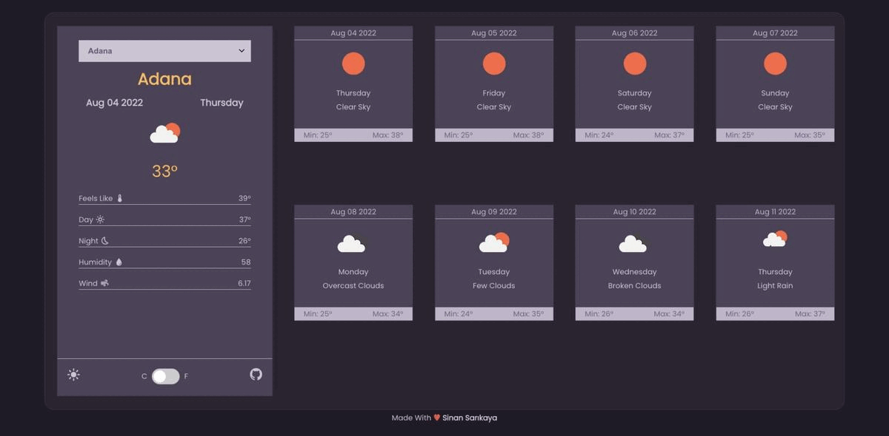
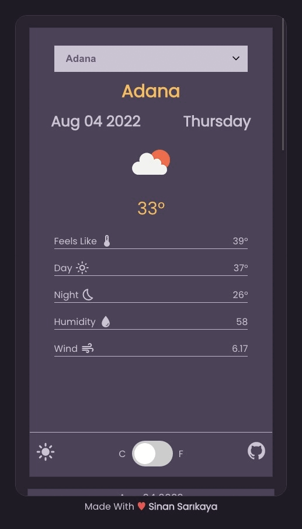

# React Weather App


Responsive weather app made using React

<hr />

### Installation Options

```
$ git clone https://github.com/sinansarikaya/react-weather-app.git
```

```
$ npm install
```

```
$ npm start
```

### Or

```
$ git clone https://github.com/sinansarikaya/react-weather-app.git
```

```
$ yarn
```

```
$ yarn start
```

<hr />

### Demo

#### [View Demo](https://sinan-react-weather-app.netlify.app/)



